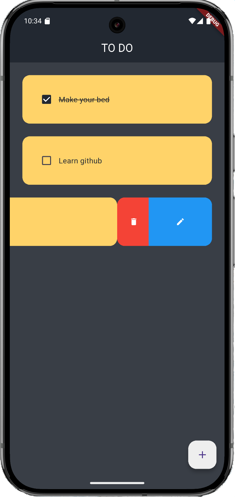

# ToDo App (Flutter + SQLite)

A simple and lightweight ToDo application built using Flutter. It allows users to add, edit, delete, and mark tasks as completed. All data is stored locally using SQLite with the help of the `sqflite` package.

---

## Technologies Used

- **Flutter** – UI toolkit for building natively compiled apps
- **Dart** – Programming language for Flutter
- **sqflite** – SQLite plugin for Flutter
- **path_provider** – To find correct local paths for storing the database

---

## Installation

1. Clone the repository: git clone https://github.com/MajstorUgvej/ToDoApp.git

2. Install dependencies: flutter pub get

3. Run the app: flutter run

---

## Local Database Setup

The app uses the sqflite package to create and manage a local SQLite database. On first run, a tasks.db file is created automatically in the app’s local storage directory.

Each task includes:

* id (int, auto-incremented)

* title (string)

* isDone (bool)

### Preview
 
